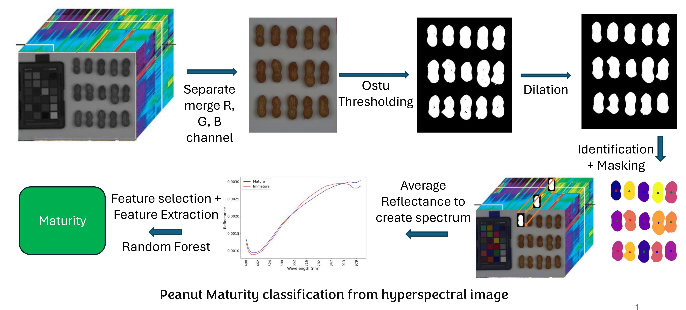

# Peanut_Maturity_Classification

## Project Overview

This project presents a hyperspectral imaging and machine learning pipeline for **peanut maturity classification**. The workflow begins with raw hyperspectral peanut images and processes them into structured spectral features that can be used for classification. The final goal is to distinguish peanut maturity classes using **Random Forest (RF)** models trained on processed spectral data.

The repository is organized around two main stages:

1. **Hyperspectral image preprocessing and feature extraction**
2. **Random Forest training, model selection, and evaluation** 

### Important Code Files

#### `data_ready.py`
This is the core preprocessing module. It handles reading hyperspectral image files, visualizing selected bands, creating RGB representations, performing Otsu thresholding, cleaning masks with morphological operations, locating peanut regions, extracting peanut pixel reflectance values, and generating feature matrices. It is the main file responsible for converting raw hyperspectral images into usable spectral representations.

Key responsibilities:
- Read hyperspectral image data
- Generate RGB visualizations
- Segment peanut regions from the background
- Identify individual peanuts
- Extract spectral reflectance values
- Create spectral and spatial-spectral feature representations

#### `datacreation.py`
This is the main execution script for feature generation. It runs the preprocessing workflow on a given hyperspectral image file and produces the output CSV files used for downstream learning. In particular, it generates:
- `Spectral.csv`
- `Spatial_spectral.csv`

This file acts as the entry point for transforming raw image data into machine-learning-ready features.

#### `all_functions.py`
This file contains helper functions for dataset preparation, feature selection, and evaluation. It supports combining and formatting the peanut datasets, selecting informative features, and computing classification metrics used in the RF experiments. It forms the bridge between the extracted spectral data and the machine learning notebooks. 

#### `Grid_Search_for_best_models.ipynb`
This notebook is used for hyperparameter tuning and model selection. It searches for the best Random Forest settings after applying preprocessing and feature-selection strategies. This notebook is important for identifying the strongest classification pipeline.

#### `Classification.ipynb`
This notebook performs the final model evaluation. It uses prepared datasets and saved RF models to measure classification performance and summarize results. :contentReference

### Overall Pipeline

The complete project workflow can be summarized as:

**Raw hyperspectral peanut image**  
→ **Image preprocessing and peanut segmentation**  
→ **Spectral / spatial-spectral feature extraction**  
→ **Dataset preparation and feature selection**  
→ **Random Forest training and hyperparameter tuning**  
→ **Final maturity classification and evaluation** 

### Repository Outputs

The repository also includes saved RF model artifacts, evaluation result files, and a precision-recall image, showing that the project supports both training and final reporting of classification performance.

## System Setup

Run the following lines to set up the system 

* Create a new environment
  * conda create --name Peanut
* Activate Peanut Maturity environment
  * conda activate Peanut
* Install All Libraries
  * pip install envi
  * pip install opencv-python
  * conda install matplotlib
  * conda install scikit-learn
  * conda install pandas
  * conda install pillow
  * install git [installation instruction for windows](https://github.com/git-guides/install-git)
* Change the directory where you want to download all the files
  * cd Directory (Example: cd C:/Users/tushar/Documents) 
* Download all the files
  * git clone https://github.com/stushar047/Peanut_Maturity_Classification.git  

## Run the code

* For running the code, always make sure that you are in the write environment and write directory 
  * conda activate Peanut
  * cd Peanut_Maturity_Classification
  * download the files
* Run the code
  * python datacreation.py filename_before_space_portion (python datacreation.py Example: 3A_1-15_Side1_20160914_0001_cnbh)
## Collect all the files required
There will be two types of file that needs to be collected and uploaded in a google drive
1. Image file 
Image files are RGB_image_{{filename}.jpg, Ostu_thresholded_image_{filename}.jpg, Morphologically_processed_image{filename}.jpg and Peanut_identification_{filename}.jpg 
2. csv file  
Spectral.csv, Spatial_spectral.csv

## Check the plots to make sure everything is right
* Run this code
  * python Plots.py
* Match the Plots with
  * Check the plots with figure 4 of this [paper](https://www.sciencedirect.com/science/article/pii/S1537511019308621)    

